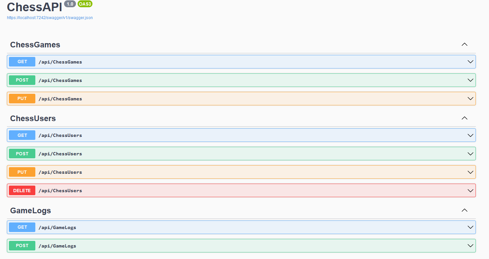

<h1 style="text-align: center;">Devin Ward</h2>

         

Hello! My Name is Devin Ward, I'm a student interested in software and web development. I've collected some of my hosted projects and notable examples from my undergraduate classes below.


[Resume (Spring 2024)](DWResume2024-1.pdf)

## Projects
Projects Currently Listed on Github:

***Active***
- [Artifact / Chess Dungeon Game](https://github.com/speedacm/GD2024ChessDungeon)
		Current game development project for Speed Association of Computing Machinery, built in Unreal Engine using blueprints and C++.
- Portfolio Website WIP (.NET Model View Controller) 

***Inactive***
- [2D Platformer (Catformer)](https://github.com/speedacm/Game-Dev-Catformer)
		Second game development project for Speed ACM. 2D platformer built in Godot game engine with Python-like scripting language GDscript. 
- [Dungeon Crawler](https://github.com/speedacm/GameDevSHMUP)
		First game development project for Speed ACM, built in Godot.

# Undergrad Portfolio

## Web Development Project
This project was the culimnation of the semester's work in full stack development. The project consists of three major parts: a Database (hosted on Azure and manged through Microsoft SQL server managment studio), an ASP.NET API, and a front end windows form admin panel application.   

**API Portion**
This Code snippet is pulled from the API portion of the project, and covers 3 of 9 HTTPS requests handled by the API.

<details> 
  <summary> Code Snippet </summary>

```c#
namespace ChessAPI.Controllers
{
    [Route("api/[controller]")]
    [ApiController]
    public class ChessGamesController : ControllerBase
    {
        [HttpGet(Name = "GetChessGames")]
        public IActionResult GetChessGames(int GameID)
        {
            using (ChessGamesDBContext cgdbc = new ChessGamesDBContext())
            {
                ChessGames foundchessgame = cgdbc.ChessGames.Find(GameID);

                if (foundchessgame != null)
                {
                    return Ok(foundchessgame);
                }
                else
                {
                    return NotFound($"Game ID {GameID} does not exist");
                }
            }
        }

        [HttpPost(Name = "PostChessGames")]
        public IActionResult PostChessGames([FromBody] ChessGames gameData)
        {
            using (ChessGamesDBContext cgdbc = new ChessGamesDBContext())
            {
                ChessGames foundchessgame = cgdbc.ChessGames.Find(gameData.GameID);

                if(foundchessgame == null)
                {
                    cgdbc.ChessGames.Add(gameData);
                    cgdbc.SaveChanges();
                    return Ok(gameData);
                }
                else
                {
                    return BadRequest($"The Game ID {gameData.GameID} already exists");
                }
            }
        }

        [HttpPut(Name = "PutChessGames")]
        public IActionResult PutChessGames(int GameID, [FromBody] ChessGames gameData)
        {
            using (ChessGamesDBContext cgdbc = new ChessGamesDBContext())
            {
                ChessGames foundchessgame = cgdbc.ChessGames.Find(GameID);

                if (foundchessgame != null)
                {
                    foundchessgame.PlayerID1 = gameData.PlayerID1;
                    foundchessgame.PlayerID2 = gameData.PlayerID2;
                    foundchessgame.WinningPlayer = gameData.WinningPlayer;
                    foundchessgame.LosingPlayer = gameData.LosingPlayer;
                    foundchessgame.GameTime = gameData.GameTime;

                    cgdbc.SaveChanges();
                    return Ok(gameData);
                }
                else
                {
                    return NotFound($"Game ID {GameID} does not exist");
                }
            }
        }
    }
}
```
</details>

Here is A full list of the requests the API handles through the Swagger API utility:


**Application Portion**
<details> 
  <summary> Code Snippet </summary>
  
```c#
        //POST request for Users
        private async void createGamebtn_Click(object sender, EventArgs e)
        {
            DateTime gameTime = DateTime.Parse(gameTimeTextbox.Text);

            var data = new
            {
                gameID = 0,
                playerID1 = playerID1TextBox.Text,
                playerID2 = playerID2TextBox.Text,
                winningPlayer = winningPlayerTextBox.Text,
                losingPlayer = losingPlayerTextBox.Text,
                gameTime = gameTime
            };

            var jsondata = JsonSerializer.Serialize(data);
            var content = new StringContent(jsondata, Encoding.UTF8, "application/json");

            using (HttpClient chessClient = new HttpClient())
            {
                try
                {
                    chessClient.BaseAddress = new Uri($"https://localhost:{port}/api/");
                    var response = await chessClient.PostAsync($"ChessGames?GameID=0", content);

                    response.EnsureSuccessStatusCode();

                    MessageBox.Show("New Game Created");
                    newGameLogbtn.Enabled = true;
                    gamesSearchTextBox.Text = "";
                }
                catch (HttpRequestException err)
                {
                    MessageBox.Show("New game not created. Please fill in all fields");
                    newGameLogbtn.Enabled = false;
                }
            }
        }


        //GET Request for Users
        private async void getUserbtn_Click(object sender, EventArgs e)
        {
            using (HttpClient chessClient = new HttpClient())
            {
                try
                {
                    chessClient.BaseAddress = new Uri($"https://localhost:{port}/api/");

                    chessClient.DefaultRequestHeaders.Add("User_Agent", "CIS411FinalAssignment");
                    chessClient.DefaultRequestHeaders.Accept.Add(new MediaTypeWithQualityHeaderValue("application/json"));

                    string UserID = userIDTextBox.Text;
                    System.IO.Stream pageinfo = null;
                    var response = await chessClient.GetAsync($"ChessUsers?UserName={UserID}");
                    response.EnsureSuccessStatusCode();
                    pageinfo = await response.Content.ReadAsStreamAsync();
                    editUserbtn.Enabled = true;
                    deleteUserbtn.Enabled = true;
                    button1.Enabled = false;

                    ChessUser chessUser = JsonSerializer.Deserialize<ChessUser>(pageinfo);

                    usernameOutlbl.Text = chessUser.userName;
                    RegisterDateOutlbl.Text = "" + chessUser.registerDate;
                    dateOfBirthOutlbl.Text = "" + chessUser.dateOfBirth;
                    userRankOutlbl.Text = chessUser.userRank;
                    eloScoreOutlbl.Text = "" + chessUser.eloScore;
                    displayNameOutlbl.Text = chessUser.displayName;
                }
                catch (HttpRequestException err)
                {
                    MessageBox.Show($"User Not Found");
                    editUserbtn.Enabled = false;
                    deleteUserbtn.Enabled = false;
                    button1.Enabled = true;
                    newUsernameTextBox.Text = userIDTextBox.Text;
                }
            }
        }
```
</details>


- Automata Theory
- Algorithms
- [Data Structures C++](https://github.com/wDvy/wDvy/tree/main/Data%20Structures)
- [Analytical Programming (Python)](https://github.com/wDvy/wDvy/tree/main/Analytical%20Programming)
- [Software Development I & II (C#)](https://github.com/wDvy/wDvy/tree/main/Software%20Development)
- [Web Application Development (ASP.NET)](https://github.com/wDvy/wDvy/tree/main/Web%20Application%20Development/Simple%20API%20Homework%20(GET))
- Design of Databases (Microsoft SQL Server)
- [Systems Analysis and Design](https://github.com/wDvy/wDvy/tree/main/Systems%20Analysis%20and%20Design)


